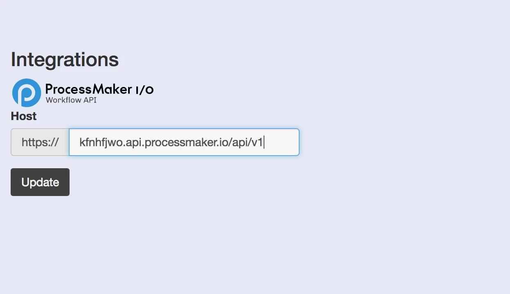

## How to Install FlarePoint CRM with the Integrated ProcessMaker I/O Widget


This tips relate to the modified Flare Point CRM. The original instructions for the [FlarePoint CRM](https://github.com/Bottelet/Flarepoint-crm) is here


**How to Install Flare Point CRM**


1. Insert the project into an empty folder / git clone `git@github.com:ProcessMaker/flarepoint-crm-pmio-loan-appproval.git`
1. Create an empty database table
1. Copy .env.example to .env and insert the Database config
1. Run the following commands:

```
composer install
php artisan migrate --seed
php artisan key:generate
```

Log in with these credentials:

- Email: admin@admin.com,
- Password: admin123 (can be changed on the dashboard)

**Set Up the ProcessMaker I/O instance**


1. Go to Settings >Integrations and paste the URL of your ProcessMaker I/O [instance core](#create_instance).

    

1. Go to the Users section and paste the access token keys for the two users that you got from ProcessMaker I/O [instance core](#create_instance).

    


